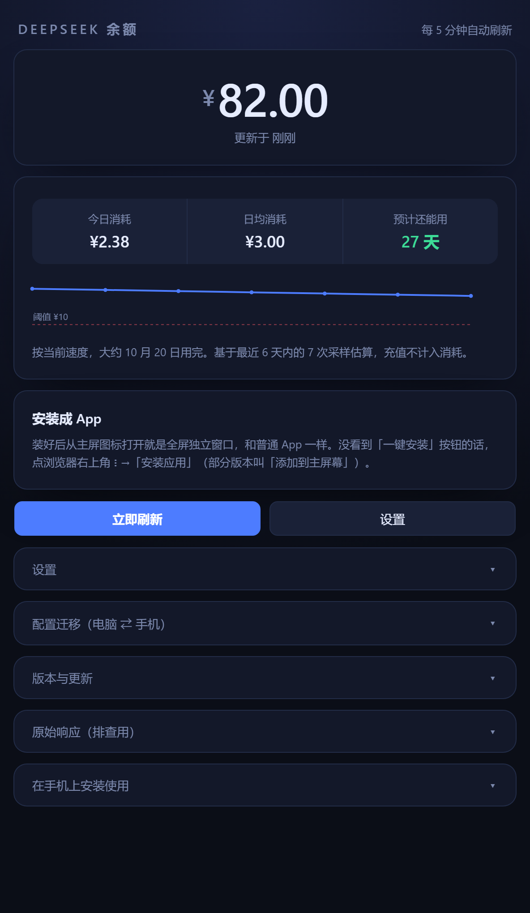

# DeepSeek 余额

在手机和电脑上查看 DeepSeek API 账户余额、今日消耗和预计还能用几天。
网页版加一个安卓桌面小组件，**没有服务端**——API Key 只存在你自己的设备上。



## 使用

|          |                                                                    |
| -------- | ------------------------------------------------------------------ |
| 浏览器   | <https://kaokaoyuba.github.io/ds-balance/deepseek-balance.html>     |
| 安卓     | [下载 APK](https://kaokaoyuba.github.io/ds-balance/releases/ds-balance.apk) |

安卓版装好后打开应用填一次 API Key，再从桌面添加小组件。小组件在 vivo
等系统里叫「应用挂件」，不在「小组件」那一栏。应用里的「版本与更新」
会告诉你有没有新版，也保留着历史版本供回退。

## 功能

- 余额、今日消耗、日均消耗、预计可用天数
- 余额走势迷你折线，叠上你自己的告警阈值
- 低于阈值时提醒；只在跌破的那一次通知，不会每轮刷新重复轰炸
- **数据过期会明说**：刷新失败或久未更新时数字会弱化并注明原因，
  不让旧值冒充当前值
- 断网可用，显示上次已知的余额并标注时间
- Key 和全部采样历史可导出成一段码，换设备粘贴即恢复
- 可安装成 PWA；安卓小组件支持 2×2 ～ 3×4 缩放，按尺寸自适应内容

## 为什么没有服务端

DeepSeek 的 `GET /user/balance` 会**动态回显请求的 `Origin`**，连 `file://`
页面发出的 `Origin: null` 都放行。所以浏览器能直接调它，不需要任何代理。

这一条决定了整个架构：

- 一个 HTML 文件就是完整应用，双击就能用
- Key 只进浏览器或应用的本地存储，只发往 `api.deepseek.com`
- 页面零外部资源（没有 CDN、web 字体、统计脚本），可以离线审计

## 目录

```
deepseek-balance.html   网页版全部内容（HTML + CSS + JS，单文件）
sw.js                   Service Worker：离线缓存与通知通道
manifest.json           PWA 清单
versions.json           版本清单，网页据此显示可用版本和更新提示
icons/                  图标
releases/               安卓安装包，按版本号逐个保留，供回退
assets/                 README 配图
```

安卓工程源码和开发脚本不在仓库里。这个目录同时是工作目录，还放着草稿和
本地配置，所以 `.gitignore` 用的是**白名单**——默认忽略一切，只放行上面
列出的发布内容，避免往目录里扔东西时误传到公开仓库。

## 本地开发

```bash
python serve.py      # 局域网静态服务，手机也能连；Windows 上可双击 start-server.bat
```

**网页版**没有构建步骤，改完刷新即可。

**安卓版**需要 Android SDK 和 JDK 17+：

```bash
cd android
ANDROID_HOME=/path/to/sdk gradle :app:testDebugUnitTest :app:assembleDebug
```

工程刻意不引入 AndroidX、也不用 Flutter——依赖越少，构建越不容易卡住。
消耗统计、采样合并、小组件布局决策这些逻辑都放在不依赖安卓 API 的纯 Kotlin
文件里，因此能用 JVM 单元测试覆盖，**不需要真机**。

## 发版

1. 改 `android/app/build.gradle.kts` 里的 `versionCode` 和 `versionName`
2. 构建，把 APK 复制成 `releases/ds-balance-<版本>.apk`，同时覆盖 `releases/ds-balance.apk`
3. **在 `versions.json` 的 `releases` 顶部加一条**：版本号、日期、文件名、一句话简介、详细说明
4. 改了网页就同步更新 `deepseek-balance.html` 里的 `WEB_BUILD` 常量

旧版本的 APK 不要删——回退能力是「版本与更新」这个功能的全部意义。

## 已知限制

**应用完全关闭后不会告警。** 浏览器和安卓都不允许网页在后台长期驻留，
要做到关着也能收到推送就需要常驻服务端，与上面「没有服务端」的取舍冲突。

**安卓小组件在应用关闭时最快 30 分钟更新一次。** `updatePeriodMillis`
的 1800000ms 是系统硬下限，填更小的值会被忽略。应用开着时两者是实时同步的，
小组件右下角也有手动刷新按钮。

**手机和电脑的历史不互通**，它们是两份独立的本地存储。需要时用「配置迁移」搬运。

## 不打算做的

**多平台支持**（Kimi、SiliconFlow、OpenRouter 等）。已确认其中几家允许浏览器
直连，但各家返回的语义并不一致——有的是余额，有的是已用额度——需要逐个核对
且长期跟进接口变动。

**常驻前台服务**。它是应用关闭后提高小组件刷新频率的唯一办法，代价是一条
永久通知加上明显耗电，对余额监控来说不划算。
